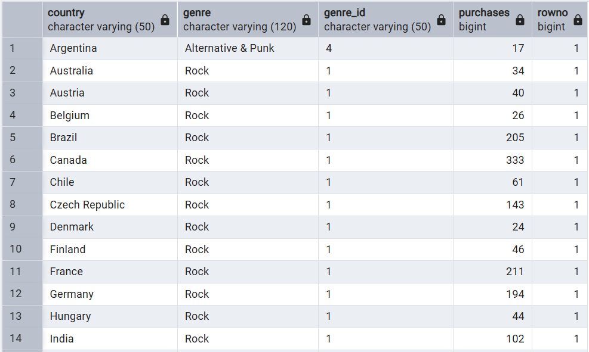

# 🎵 Music Store SQL Analysis

This project analyzes a digital music store database using **PostgreSQL**.  
The database contains information about employees, customers, invoices, tracks, playlists, artists, albums, and more.  
Through SQL queries, we explore **sales trends, customer behavior, popular genres, top artists, and revenue insights**.


---

## 🛠️ Tools & Technologies
- PostgreSQL  
- SQL (queries, joins, aggregations, subqueries)  
- pgAdmin / psql (for running queries)  
- Git & GitHub for version control  

---

## 🧩 Project Structure

```
├── Create_table_query.sql     # All CREATE TABLE Query
├── Questions.txt              # List of analysis questions
├── Answers.sql                # All SQL analysis queries
├── music_store_csv.zip        # Contains all 11 dataset files in CSV format
├──📂images/
│ ├── schema_diagram.png       # Schema diagram
│ └── output.png               # Query Output example
└── README.md                  # Project documentation
```
---

## 🗄️ Database Schema
The database has **11 tables**:

- **Employee** → Employee details  
- **Customer** → Customer info  
- **Invoice** → Purchase invoices with billing details and total  
- **Invoice_Line** → Details of tracks purchased in each invoice  
- **Track** → Tracks information  
- **Playlist** → Music playlists  
- **Playlist_Track** → Mapping between playlists and tracks  
- **Artist** → Artist information  
- **Album** → Albums created by artists  
- **Media_Type** → File/media type of tracks  
- **Genre** → Music genres  

📊 **ER Diagram:**


---

## 📝 Query Showcase (Example)

**Problem:** We want to find out the most popular music Genre for each country. We determine the 
most popular genre as the genre with the highest amount of purchases. Write a query 
that returns each country along with the top Genre. For countries where the maximum 
number of purchases is shared return all Genres

#### Query
```sql
WITH popular_genre AS (
	SELECT c.country,g.name AS genre,g.genre_id,
	COUNT(il.quantity) AS purchases,
	ROW_NUMBER() OVER(PARTITION BY c.country ORDER BY COUNT(il.quantity) DESC) AS RowNo 
	FROM customer c
	JOIN invoice i ON i.customer_id=c.customer_id
	JOIN invoice_line il ON il.invoice_id=i.invoice_id
	JOIN track t ON t.track_id=il.track_id
	JOIN genre g ON g.genre_id=t.genre_id
	GROUP BY 1,2,3
	ORDER BY 1 ASC ,4 DESC
)
SELECT * FROM popular_genre 
WHERE RowNo <=1;
```
#### Output :


---

## 🚀 How to Run
1. Clone this repository:
```bash
   git clone https://github.com/Harsh-Belekar/Music-Store-SQL-Analysis.git
```

---

## 🧑‍💻 Author

**👤 Harsh Belekar**  
📍 Data Analyst | Python | SQL | Power BI | Excel | Data Visualization  
📬 [LinkedIn](https://www.linkedin.com/in/harshbelekar) | 🔗[GitHub](https://github.com/Harsh-Belekar)

📧 [harshbelekar74@gmail.com](mailto:harshbelekar74@gmail.com)
